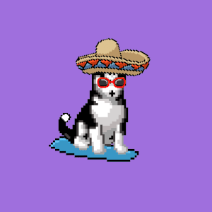

|Hilarious Huskies App|
|:-:|
||

## ERC-721 tokens on the Ethereum blockchain and hosted on IPFS.
 

Hilarious Huskies is an NFT collection inspired by Siberian Huskies, which are loyal, friendly, and plagued with wanderlust. This collection is a tribute to our furry friends.

Your NFT also doubles up as a membership card that will allow you access to enhancements as we hit future project milestones which you can get further
information on here. 
 
https://wallid.io/nftproof

Follow us on twitter :  https://twitter.com
 
Join the discord to find out more! :  https://discord.gg/bYCs6UMWDS
 
Provenance : https://www.hilarioushuskies.life/provenance/
 
Opensea : https://opensea.io/collection/hilarioushuskies
 
Contract Verification : https://etherscan.io/address/0x6e918a90dcb258353acCa3Dfdb2A54A5D81C4596/
 
## Interact with the Hilarious Huskies ERC 721 ETH contract
 

### Enable JavaScript to run this app

To begin the development, run `npm start` or `yarn start`.
 
To create a production bundle, use `npm run build` or `yarn build`.
 

Refer to the index.html for template and use.
